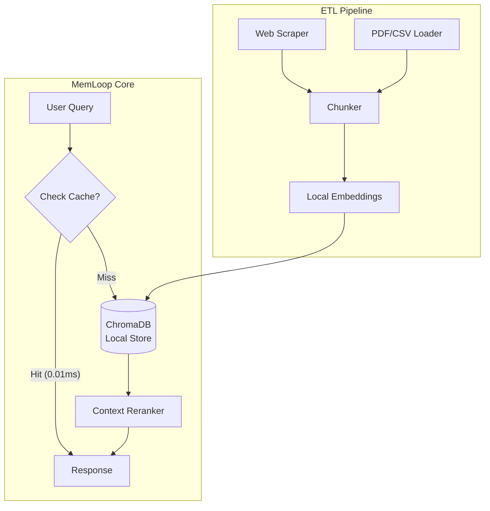

# MemLoop: Local Vector Memory for AI Agents

> **"Give your AI infinite memory without the API bills."**

**MemLoop** is a production-ready, local-first memory orchestration engine designed to give LLMs (like Gemini, GPT-4, Llama 3) long-term retention capabilities. It bridges the gap between transient context windows and persistent vector storage.

Unlike wrapper libraries, MemLoop implements a custom **Dual-Memory Architecture** (Short-term buffer + Long-term Vector Store) and runs entirely offline.

---

## Why MemLoop?

* **Privacy-First & Offline:** Runs 100% locally using `ChromaDB` and `SentenceTransformers`. No OpenAI API keys required. Your data never leaves your machine.
* **Zero-Latency Caching:** Implements an **O(1) Semantic Cache** that intercepts repeated queries before they hit the Vector DB, reducing retrieval latency by ~99%.
* **Citation-Aware Retrieval:** Don't just get text; get the source. MemLoop tracks **Page Numbers, Row Indices, and URLs** so your AI can cite its sources (e.g., *"Source: manual.pdf, Page 12"*).
* **Universal Ingestion:** Built-in ETL pipeline that automatically ingests:
* **Websites** (Recursive crawling with `BeautifulSoup`)
* **PDFs & Docs** (Automatic text chunking)
* **Tabular Data** (CSV/Excel linearizer for vector compatibility)


---

## Architecture

MemLoop decouples ingestion from retrieval, using a hybrid cache-first strategy to ensure speed and accuracy.



---

##  Quick Start

### 1. Installation

```bash
pip install memloop

```

### 2. The Interactive CLI (Chat with your Data)

Launch the built-in terminal interface to test your memory engine instantly.

```bash
$ memloop

[SYSTEM]: Initializing Neural Link...
[USER]: /learn https://en.wikipedia.org/wiki/Artificial_intelligence
[SYSTEM]: Success. Absorbed 45 chunks.
[USER]: What is AI?
[MEMLOOP]: "AI is intelligence demonstrated by machines..." (Source: Wikipedia, Chunk 12)

```

### 3. Python SDK (Build your own Agent)

Integrate MemLoop into your Python projects in 3 lines of code.

```python
from memloop import MemLoop

# Initialize Brain (Persists to ./memloop_data)
brain = MemLoop()

# A. Ingest Knowledge
print("Ingesting documentation...")
brain.learn_url("https://docs.python.org/3/")
brain.learn_local("./my_documents_folder")

# B. Add Conversation Context
brain.add_memory("User is building a React app.")

# C. Retrieve Context (with Caching & Citations)
context = brain.recall("How do python decorators work?")

print(context) 
# Output: 
# "Short Term: User is building a React app..."
# "Long Term: [1] Decorators are functions... (Ref: python.org, Section 4.2)"

```

---

## Integration Example: MemLoop + Gemini

Here is how to use MemLoop as the "Long-Term Memory" for a Gemini (or OpenAI) agent.

```python
import google.generativeai as genai
from memloop import MemLoop

# 1. Setup Memory
brain = MemLoop()

# 2. Setup LLM
genai.configure(api_key="YOUR_API_KEY")
model = genai.GenerativeModel('gemini-2.5-flash')

def ask_agent(query):
    # Retrieve relevant memories locally (Free & Fast)
    context = brain.recall(query)
    
    # Send only relevant context to LLM
    prompt = f"""
    Use the following context to answer the user.
    Context: {context}
    
    User: {query}
    Answer:
    """
    response = model.generate_content(prompt)
    return response.text

```

---

## Supported Formats

| Format | Features |
| --- | --- |
| **.txt / .md** | Standard text chunking with overlap. |
| **.csv** | **Row Linearization**: Converts rows into narrative sentences for better vector matching. |
| **.pdf** | **Page Tracking**: extracts text while preserving page numbers for citations. |
| **URLs** | **Smart Scraper**: Auto-removes HTML boilerplate (scripts, navbars, ads). |

---

## 🗺️ Roadmap

* [x] Local Vector Storage (ChromaDB)
* [x] Semantic Caching (LRU Strategy)
* [x] Web & Local File Ingestion
* [ ] Multi-Modal Support (Image Embeddings)
* [ ] GraphRAG Integration (Knowledge Graphs)

---

## Contributing

Contributions are welcome! Please open an issue or submit a PR.

1. Fork the repo
2. Create your feature branch (`git checkout -b feature/amazing-feature`)
3. Commit your changes (`git commit -m 'Add some amazing feature'`)
4. Push to the branch (`git push origin feature/amazing-feature`)
5. Open a Pull Request

---

**Built with ❤️ by [Vansh]**(https://github.com/vanshcodeworks)